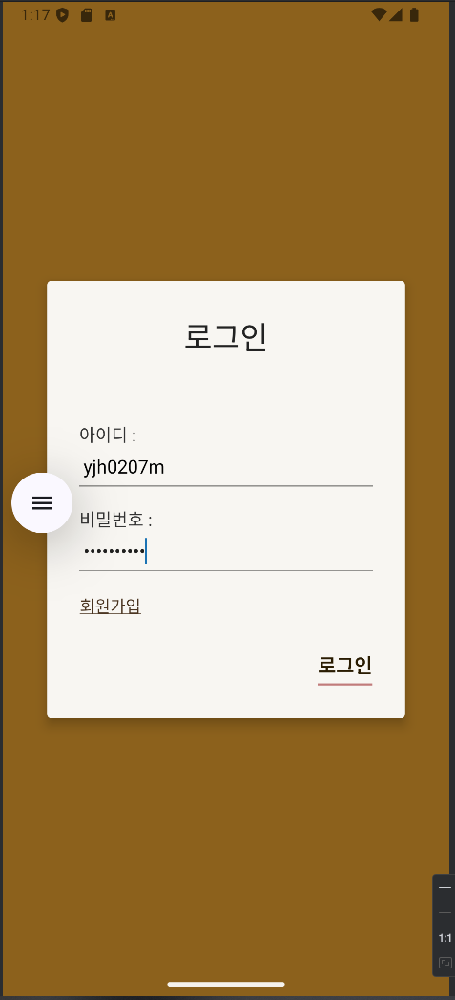
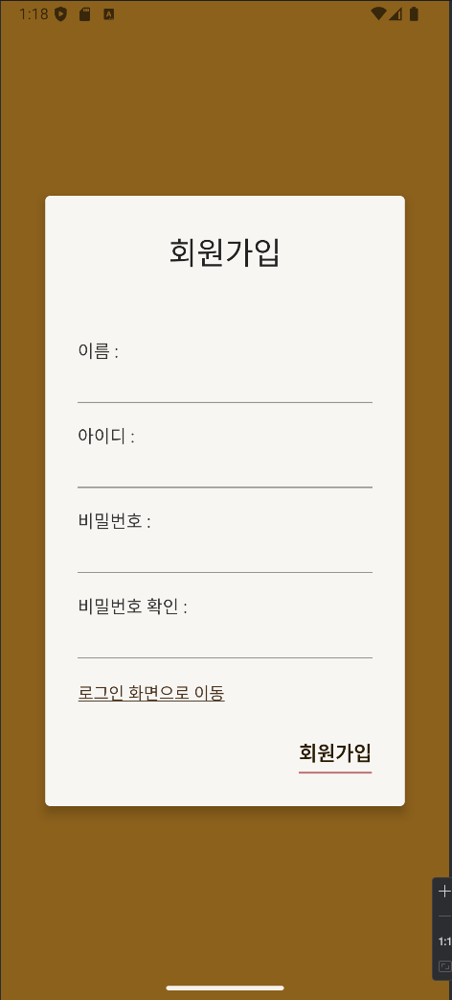
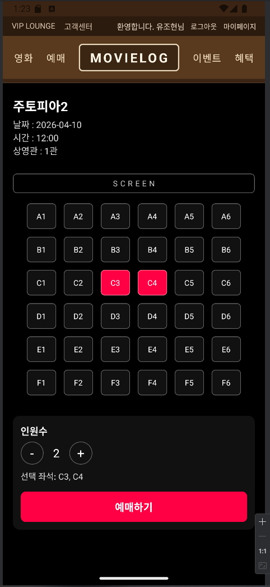
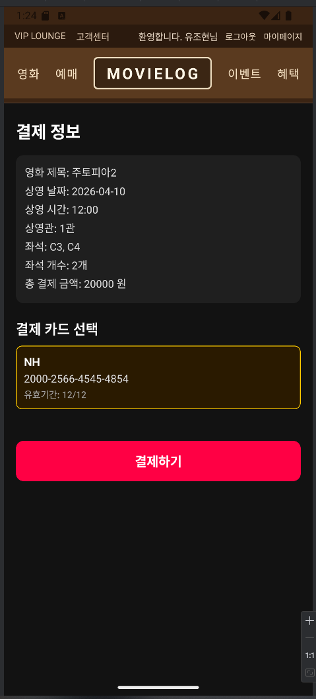
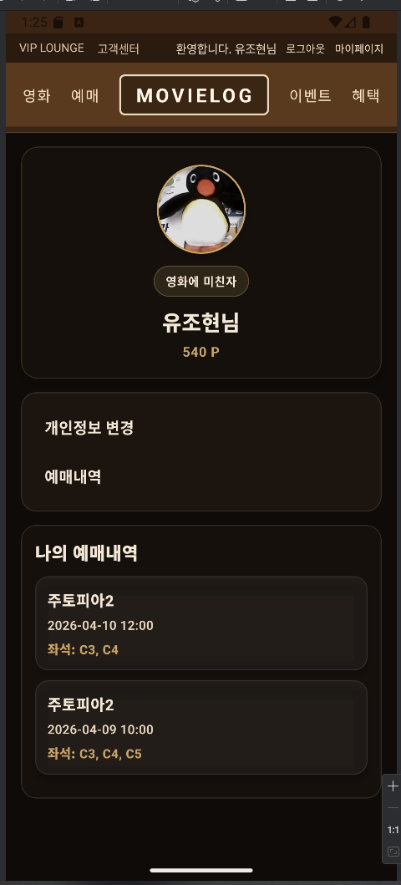
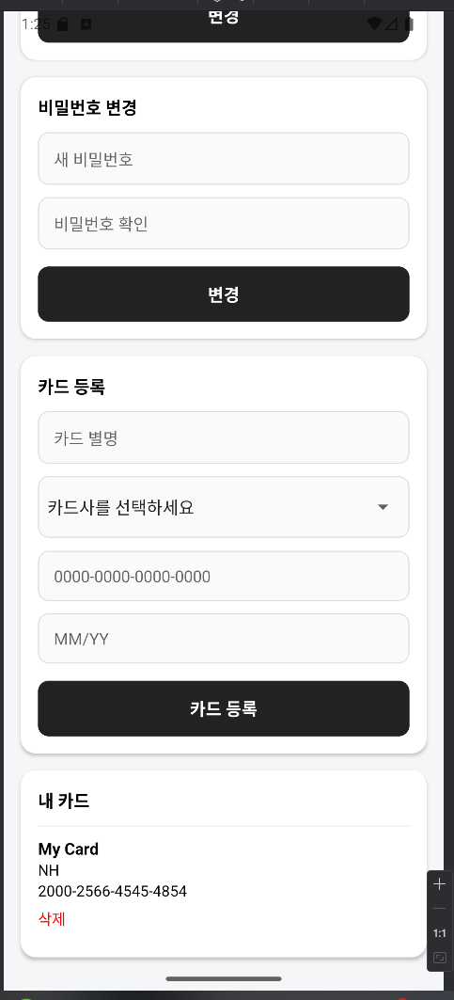

# MOVIELOG

> React Native 기반 영화 예매 모바일 앱

<br>

## 📱 스크린샷

<table>
  <tr>
    <td align="center"><b>메인 화면</b></td>
    <td align="center"><b>로그인</b></td>
    <td align="center"><b>회원가입</b></td>
  </tr>
  <tr>
    <td></td>
    <td></td>
    <td></td>
  </tr>
  <tr>
    <td align="center"><b>영화 예매</b></td>
    <td align="center"><b>좌석 선택</b></td>
    <td align="center"><b>결제</b></td>
  </tr>
  <tr>
    <td></td>
    <td></td>
    <td></td>
  </tr>
  <tr>
    <td align="center"><b>VIP 라운지</b></td>
    <td align="center"><b>마이페이지</b></td>
    <td align="center"><b>계정 관리</b></td>
  </tr>
  <tr>
    <td></td>
    <td></td>
    <td></td>
  </tr>
</table>

<br>

## 주요 기능

- **영화 목록 / 검색** — 현재 상영 중인 영화를 탐색하고 검색
- **회원 인증** — 아이디/비밀번호 기반 로그인 및 회원가입
- **영화 예매** — 날짜·시간 선택 → 좌석 선택 → 카드 결제
- **포인트 시스템** — 예매 시 포인트 적립, 500P 이상 시 VIP 해금
- **VIP 라운지** — VIP 전용 실시간 채팅 커뮤니티
- **마이페이지** — 예매 내역 조회, 프로필 수정, 결제 카드 관리

<br>

## 기술 스택

| 분류 | 기술 |
|------|------|
| Framework | React Native 0.81 + Expo SDK 54 |
| Language | JavaScript / TypeScript |
| Navigation | React Navigation 7 (Native Stack) |
| Backend | Firebase (Auth · Firestore · Realtime DB · Storage) |
| Build | EAS (Expo Application Services) |
| Platform | Android · iOS · Web |

<br>

## 프로젝트 구조

```
MovieLogApp/
├── App.js                        # 루트 컴포넌트
├── index.js                      # 앱 진입점
├── src/
│   ├── navigation/
│   │   └── AppNavigator.js       # 전체 화면 네비게이션 스택
│   ├── screens/                  # 각 화면 컴포넌트
│   │   ├── Main/                 # 메인 홈
│   │   ├── Login/                # 로그인
│   │   ├── Join/                 # 회원가입
│   │   ├── Movies/               # 영화 목록
│   │   ├── Reservation/          # 영화 예매
│   │   ├── Seat/                 # 좌석 선택
│   │   ├── Payment/              # 결제
│   │   ├── MyPage/               # 마이페이지
│   │   ├── MyInfo/               # 개인정보 수정
│   │   ├── MyReserve/            # 예매 내역
│   │   ├── VipLounge/            # VIP 라운지
│   │   ├── Benefit/              # 혜택
│   │   ├── Event/                # 이벤트
│   │   └── Service/              # 고객센터
│   ├── components/
│   │   └── Header.js             # 공통 헤더
│   ├── utils/
│   │   ├── firebase.ts           # Firebase 초기화 및 유틸
│   │   └── firestoreRest.js      # Firestore REST API 파서
│   └── styles/
│       ├── colors.js             # 공통 색상 팔레트
│       ├── loginStyles.js
│       └── joinStyles.js
└── screen_shot/                  # 앱 스크린샷
```

<br>

## 팀원 역할 분담

> 기존 웹 프로젝트를 React Native 모바일 앱으로 이식한 프로젝트입니다.

| 이름 | 역할 |
|------|------|
| 김찬 (팀장) | 앱 기능 이식 |
| 유조현 | DB 마이그레이션 및 버그 수정 |

### 김찬 — 앱 기능 이식

- 웹 기반 UI를 React Native 컴포넌트로 전환 (HTML/CSS → StyleSheet)
- React Navigation을 이용한 화면 간 네비게이션 구현
- 공통 헤더 컴포넌트 및 메뉴 구성
- 영화 목록, 예매, 좌석 선택, 결제 화면 구현
- VIP 라운지 실시간 채팅 UI 구현
- 마이페이지, 개인정보 수정, 예매 내역 화면 구현
- Expo 환경 설정 및 빌드 구성 (EAS)

### 유조현 — DB 마이그레이션 및 버그 수정

- 웹 프로젝트의 데이터베이스 구조 분석 및 Firebase 스키마 설계
- Firestore 컬렉션 마이그레이션 (`users`, `movies`, `seats`, `user_cards`)
- 웹용 Firebase SDK 쿼리를 모바일 환경에 맞게 재작성
- Firestore REST API 파서(`firestoreRest.js`) 구현
- Realtime Database 기반 채팅 기능 연동
- 이식 과정에서 발생한 인증·데이터 연동 버그 수정
- 포인트 시스템 및 VIP 접근 권한 로직 오류 수정

<br>

## 시작하기

### 사전 요구사항

- Node.js 18+
- Expo CLI

### 설치 및 실행

```bash
# 의존성 설치
npm install

# 개발 서버 시작
npx expo start
```

실행 후 다음 방법으로 앱을 확인할 수 있습니다.

- **Android** — `a` 키 입력 또는 Android 에뮬레이터 실행
- **iOS** — `i` 키 입력 또는 iOS 시뮬레이터 실행
- **Expo Go** — QR 코드를 모바일에서 스캔

<br>

## Firebase 데이터 구조

| 컬렉션 | 설명 |
|--------|------|
| `users` | 사용자 프로필, 포인트 |
| `movies` | 영화 목록 및 예매 수 |
| `seats` | 좌석 예약 정보 |
| `user_cards` | 저장된 결제 카드 |
| `chatRooms` | VIP 라운지 실시간 채팅 (Realtime DB) |
